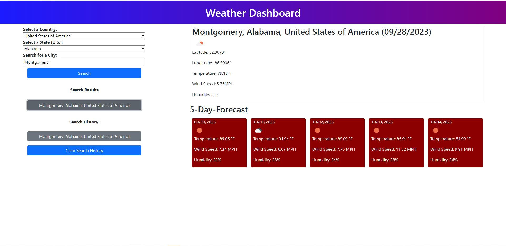

# Weather Dashboard Webpage

## Description

My motivation to build this project was that I wanted to learn how to call server-side APIs.  This project calls the Open Weather Map API and displays some of the returned data on the webpage.  I built this project to further refine my skills with JavaScript, and also to begin learning how to use server-side APIs.  This project solves the problem of a user needing to know the weather forcast for various cities, for reasons such as for planning for a vacation.  The user can search for cities on the webpage and obtain current weather data and five-day weather forecast data for those cities.  In this project, the main new skill I learned was making calls to server side APIs.  I also learned a little bit about asynchronous programming and how to use the 'fetch' command to properly make API calls. 

## Table of Contents (Optional)

This README isn't that long, so N/A.

## Installation

N/A

## Usage

To use the application, go to the following link: [https://theboss1485.github.io/weather-dashboard-webpage/](https://theboss1485.github.io/weather-dashboard-webpage/)

Once you are at the webpage, use the dropdown box on the left to select a country. If you choose a country other than the U.S.A, you can then select a city. If you select the U.S.A., you will then need to select a state before selecting the city.  After you have selected the country, city, and possibly state, click Search.  If the system finds search results for the data you entered, they will be displayed below the Search button.  If the system finds no search results, it will inform you of that with red text.  Click on one of the search results to display the weather data for that particular city.  If the response from an API call is anything other than 200, such as a 404 error, the system will display the error code number in red text.  Once you click on a search result, the system will add that result to the search history.  If the search history has items in it, you can clear the search history by clicking the Clear Search History button.  If you use the application to search for a city that is already in the search history and then click on that city, the city will be moved to the top of the search history.

Here is a screenshot of the application: 

## Notes to Graders

While I was writing this application, I discovered that there were flaws in both the Open Weather Map API that I used for weather data and the geolocating API that I used to obtain latitude and longitude city coordinates.  Sometimes, I would call the geolocating API and it would return a city name, and then when I fed the coordinates of the city back into the Open Weather Map API, it would return a different city name.  I wrote my application so that for a group of search results, if the two APIs gave differing city names, one search result would be returned, but the rest of the conflicting city names would be discarded.  If there are two instances of a city name for a specific country (and possibly U.S. state) that matched the user input, and both APIs returned a result for that city that matched each other, the result would be returned.

I did end up printing latitude and longitude on the page for each city.  My reasoning behind this was that there were some city names that matched each other exactly, and I couldn't differentiate them by state, because neither of the APIs returned a state for that city.

I also had issues with certain island nations returning no latitude and longitude data when querying them by only city name and country code, even if they did have cities in the Open Weather Map cities list (the cities list can be found [here](https://openweathermap.org/storage/app/media/cities_list.xlsx)). Christmas Island and the Cocos (Keeling) Islands were two examples of this.  Since my application finds latitude and longitude data by querying with the city name and country code, Christmas Island and the Cocos (Keeling) Islands are two examples of nations that will probably not return any data if a user queries them with my application.  If the grader wants to test this out, I would recommed using the 'curl' command in the command line, followed by a space and the API call enclosed in quotation marks. ("").

## Credits

I took a list of countries and their resective two letter codes from Mike Walter on Github:  [https://gist.github.com/incredimike/1469814](https://gist.github.com/incredimike/1469814).

Here is a link to Mike Walter's GitHub profile: [https://gist.github.com/incredimike/](https://gist.github.com/incredimike/)

I took a list of U.S. states and their respective two letter codes from Marshall Thompson on GitHub:  [https://gist.github.com/marshallswain/88f377c71aa88aceaf660b157f6d8f46](https://gist.github.com/marshallswain/88f377c71aa88aceaf660b157f6d8f46)

Here is a link to Marshall's GitHub profile: [https://gist.github.com/marshallswain/](https://gist.github.com/marshallswain/)

I followed a tutorial on tutorialspoint.com to learn how to implement the replace method: [replace() Method Tutorial](https://www.tutorialspoint.com/How-to-replace-all-occurrences-of-a-string-in-JavaScript#:~:text=To%20replace%20all%20occurrences%20of%20a%20string%20in%20JavaScript)

The tutorial above was written by Prabhdeep Singh.  Here is a link to his Tutorials Point profile: [https://www.tutorialspoint.com/authors/prabhdeep-singh](https://www.tutorialspoint.com/authors/prabhdeep-singh)

I followed a tutorial on using the Open Weather Map forecast API.  The tutorial can be found here: [https://openweathermap.org/forecast5](https://openweathermap.org/forecast5)

I followed a tutorial on using the Open Weather Map geolocating API.  The tutorial can be found here: [https://openweathermap.org/api/geocoding-api](https://openweathermap.org/api/geocoding-api)

I followed a tutorial on obtaining current weather data from the Open Weather Map API.  The tutorial can be found here: [https://openweathermap.org/current](https://openweathermap.org/current)

I also used the Xpert Learning Asistant AI Chatbot to help me learn how to write some of the code.

## License

This project is under an MIT license.  Please see the license in the GitHub repository for more information.

## Badges

I don't have any badges to display.

## Features

This application calls Open Weather Map's geolocating API to retrieve latitude and longitude data for cities the user chooses.  Then, the application calls the Open Weather Map API to retrieve weather data about those cities.  The page displays both current weather data and weather forecast data.  The application also saves the user's search history in localStorage, which the user can then delete any time he or she wishes. 

## How to Contribute

This was a project I personally completed, so N/A.

## Tests

N/A